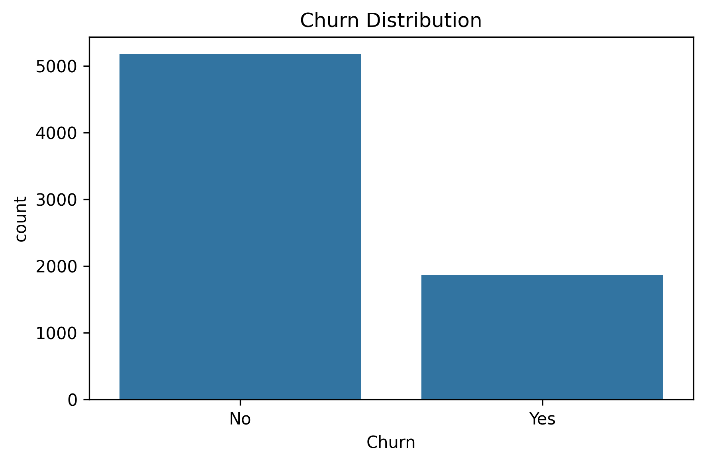
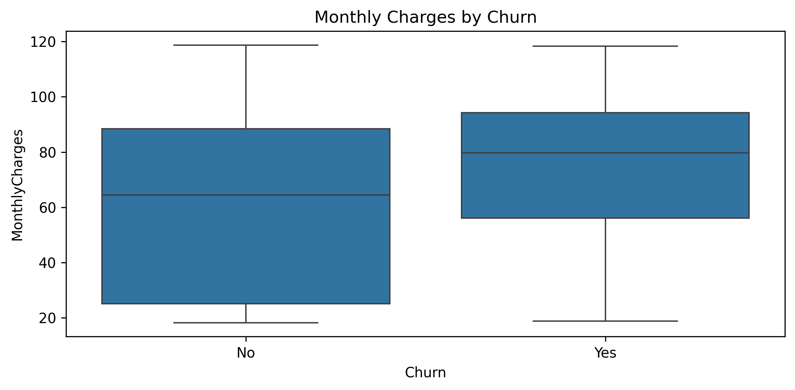
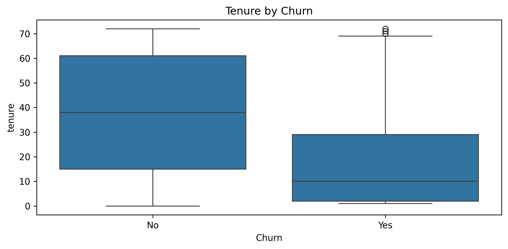
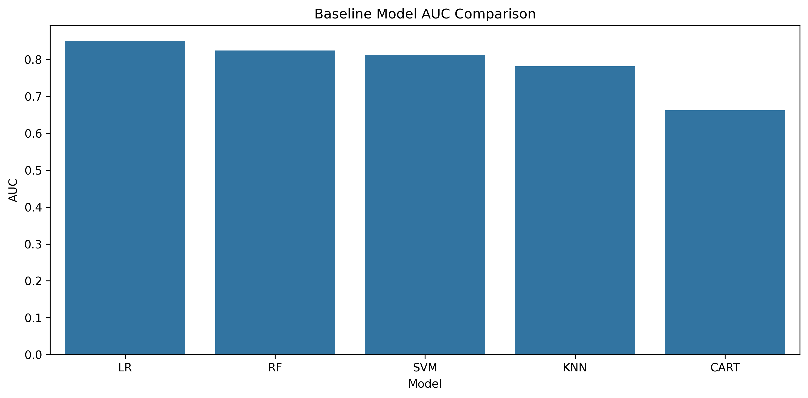
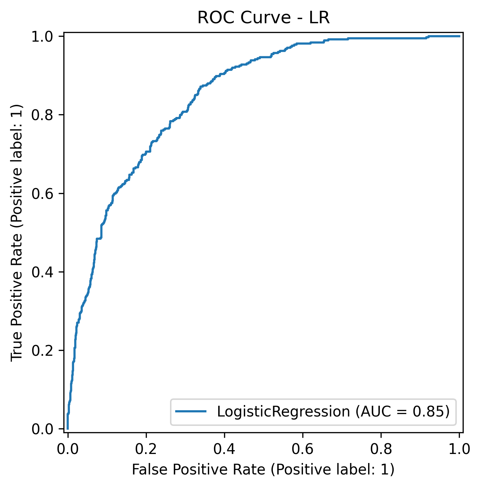

# Telco Customer Churn Prediction

An end-to-end machine learning project developed to predict customer churn for a telecom company using exploratory data analysis, feature engineering, model comparison, hyperparameter tuning, and business-oriented evaluation.

## Business Problem

Customer churn is one of the most critical problems in subscription-based businesses. Acquiring a new customer is often more expensive than retaining an existing one.
The goal of this project is to identify customers who are likely to leave the company and support proactive customer retention strategies.

## Dataset Story

The dataset contains information about 7,043 customers of a fictional telecom company in California.
It includes customer demographics, subscribed services, billing information, contract structure, payment methods, and churn status.

### Target Variable

* Churn = Yes → customer left
* Churn = No → customer stayed

## Project Workflow

1. Exploratory Data Analysis
2. Data Type Correction
3. Missing Value Analysis
4. Outlier Analysis
5. Feature Engineering
6. Encoding and Scaling
7. Baseline Model Comparison
8. Hyperparameter Optimization
9. Final Model Evaluation
10. Visual Reporting

## Technologies Used

* Python
* Pandas
* NumPy
* Matplotlib
* Seaborn
* Scikit-learn
* XGBoost
* LightGBM
* CatBoost

## Feature Engineering

* NEW_TENURE_YEAR
* NEW_Engaged
* NEW_noProt
* NEW_Young_Not_Engaged
* NEW_TotalServices
* NEW_FLAG_ANY_STREAMING
* NEW_FLAG_AutoPayment
* NEW_AVG_Charges
* NEW_Increase
* NEW_AVG_Service_Fee
* NEW_Senior_Monthly
* NEW_Risky_Payment_Profile

## Models Used

* Logistic Regression
* KNN
* Decision Tree
* Random Forest
* SVM
* XGBoost
* LightGBM
* CatBoost

## Evaluation Metrics

* Accuracy
* ROC-AUC
* Recall
* Precision
* F1-score

ROC-AUC is used as the main metric because class separation is important.

## Results

Best model: Logistic Regression

* Accuracy: ~0.81
* ROC-AUC: ~0.85
* Recall: ~0.53
* Precision: ~0.67
* F1-score: ~0.59

## Business Insights

* Month-to-month contracts have highest churn
* Low tenure customers churn more
* Electronic check users churn more
* Lack of support services increases churn

## Visualizations

## Project Structure

telco-customer-churn-prediction/
├── README.md
├── requirements.txt
├── telco_churn_prediction.py
├── Telco-Customer-Churn.csv
└── images/

## How to Run

git clone https://github.com/rabia-ASIK/telco-customer-churn-prediction.git
cd telco-customer-churn-prediction
pip install -r requirements.txt
python telco_churn_prediction.py

## Author

Rabia AŞIK
